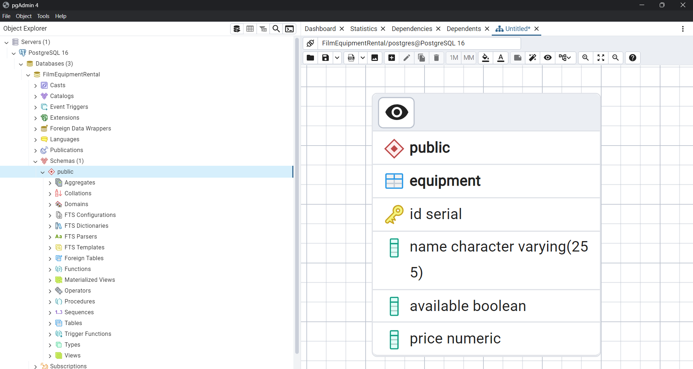

# Automatic-Email-Reply-System-for-Film-Equipment-Rental-Service

## Contents:
  * [Objective](#objective)
  * [Categories and Actions](#categories-and-actions)
      * [Inquiry Handling](#inquiry-handling)
      * [Review Handling](#review-handling)
      * [Assistance Request Handling](#assistance-request-handling)
      * [General Handling](#general-handling)
  * [Database](#database)
  * [Setup & Working](#working)
  * [Things left to do](#things-left-to-do)
   
## Objective:
Design and implement alangchain based  system that classifies incoming emails into three categories and executes specific actions based on the category. The system should enhance customer interaction by providing automated responses tailored to inquiries, reviews, and assistance requests.
## Categories and Actions:
### Inquiry Handling:
  * Database: Develop an SQL database to store details about film equipment.
  * Action: When an inquiry email is received, check the database for item avalability.
  * If available, reply with the item's price.
  * If not available, suggest similar available items.
### Review Handling:
  * Positive Reviews: Thank the sender and encourage them to share their experience on social media.
  * Negative Reviews: Escalate to the CRM system for follow-up with a phone call from customer service and offer a gift voucher in the reply.
### Assistance Request Handling:
  * Documentation: Create a document with frequently asked questions about film equipment using ChatGPT or from equipment manuals.
  * RAG Pipeline: Use a Retrieval-Augmented Generation approach to search for solutions to reported equipment issues.
  * If a suitable solution is found, provide it in the reply.
  * If no solution is found, escalate the issue to customer service.
### General Handling:
  * Forwarding: Emails that do not fit into the above categories should be forwarded to customer service for further evaluation.

## Database:

## Working:
### Setup:
 1. Clone the repo
 2. Uncomment the code in the first cell block (make sure to have jupyter notebook installed )
 3. Change the database uri and update llm api keys
 4. (OPTIONAL) make changes in emails.txt 
 5. Run all cells and wait till completion
 6. open output_results.txt
##
Here is the demo:

## Things left to do
  * Assistance Request Handling is currently unavailable
  * Yet to enable G-mail connectivity ( As of now it reads emails from email.txt, then writes the response along with the original mail to output_results.txt )
  * Overall code needs to be more optimized and cleaned up
